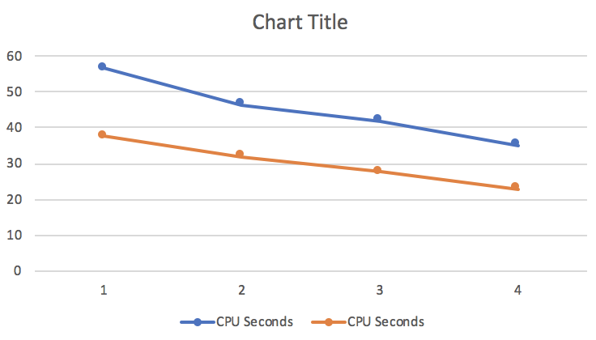
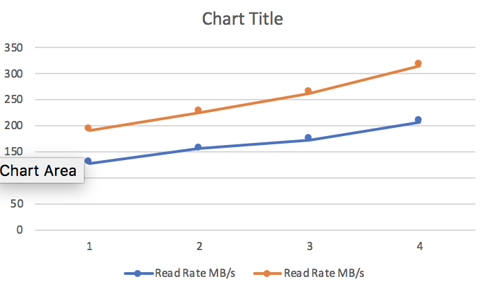

```bash
$ cat ~/7g.csv | pv -t -e -b -a | time hw-dsv query-lazy -k 0 -k 1 -k 2 -k 3 -d , -e '|' -m slow > /dev/null
7.08GiB 0:00:56 [ 128MiB/s]
hw-dsv query-lazy -k 0 -k 1 -k 2 -k 3 -d , -e '|' -m slow > /dev/null  114.39s user 15.47s system 229% cpu 56.466 total

$ cat ~/7g.csv | pv -t -e -b -a | time hw-dsv query-lazy -k 0 -k 1 -k 2 -d , -e '|' -m slow > /dev/null
7.08GiB 0:00:46 [ 156MiB/s]
hw-dsv query-lazy -k 0 -k 1 -k 2 -d , -e '|' -m slow > /dev/null  85.16s user 12.78s system 211% cpu 46.391 total

$ cat ~/7g.csv | pv -t -e -b -a | time hw-dsv query-lazy -k 0 -k 1 -d , -e '|' -m slow > /dev/null
7.08GiB 0:00:41 [ 173MiB/s]
hw-dsv query-lazy -k 0 -k 1 -d , -e '|' -m slow > /dev/null  83.08s user 12.41s system 227% cpu 41.919 total

$ cat ~/7g.csv | pv -t -e -b -a | time hw-dsv query-lazy -k 0 -d , -e '|' -m slow > /dev/null
7.08GiB 0:00:34 [ 207MiB/s]
hw-dsv query-lazy -k 0 -d , -e '|' -m slow > /dev/null  71.99s user 11.12s system 237% cpu 34.976 total

$ cat ~/7g.csv | pv -t -e -b -a | time hw-dsv query-lazy -k 0 -k 1 -k 2 -k 3 -d , -e '|' > /dev/null
7.08GiB 0:00:37 [ 192MiB/s]
hw-dsv query-lazy -k 0 -k 1 -k 2 -k 3 -d , -e '|' > /dev/null  64.48s user 9.89s system 197% cpu 37.636 total

$ cat ~/7g.csv | pv -t -e -b -a | time hw-dsv query-lazy -k 0 -k 1 -k 2 -d , -e '|' > /dev/null
7.08GiB 0:00:32 [ 226MiB/s]
hw-dsv query-lazy -k 0 -k 1 -k 2 -d , -e '|' > /dev/null  54.02s user 8.52s system 195% cpu 32.023 total

$ cat ~/7g.csv | pv -t -e -b -a | time hw-dsv query-lazy -k 0 -k 1 -d , -e '|' > /dev/null
7.08GiB 0:00:27 [ 263MiB/s]
hw-dsv query-lazy -k 0 -k 1 -d , -e '|' > /dev/null  48.43s user 7.67s system 203% cpu 27.526 total

$ cat ~/7g.csv | pv -t -e -b -a | time hw-dsv query-lazy -k 0 -d , -e '|' > /dev/null
7.08GiB 0:00:22 [ 315MiB/s]
hw-dsv query-lazy -k 0 -d , -e '|' > /dev/null  45.24s user 7.11s system 227% cpu 22.982 total
```

```text
method  columns  Read Rate MB/s  cpu seconds
slow          4             128       56.466
slow          3             156       46.391
slow          2             173       41.919
slow          1             207       34.976
fast          4             192       37.636
fast          3             226       32.023
fast          2             263       27.526
fast          1             315       22.982
```



